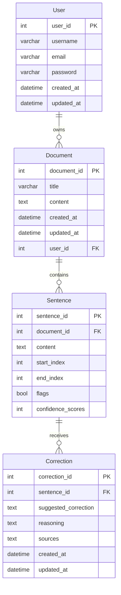

# Entity Relationship Diagram

## Model Notes

* `flags` marks sentences that the AI believes need attention.
* `confidence_scores` stores the AI confidence (0-100) so the UI can prioritize low-certainty claims.
* Corrections persist the AI response, enabling learners to reapply suggestions even after leaving the workspace.
